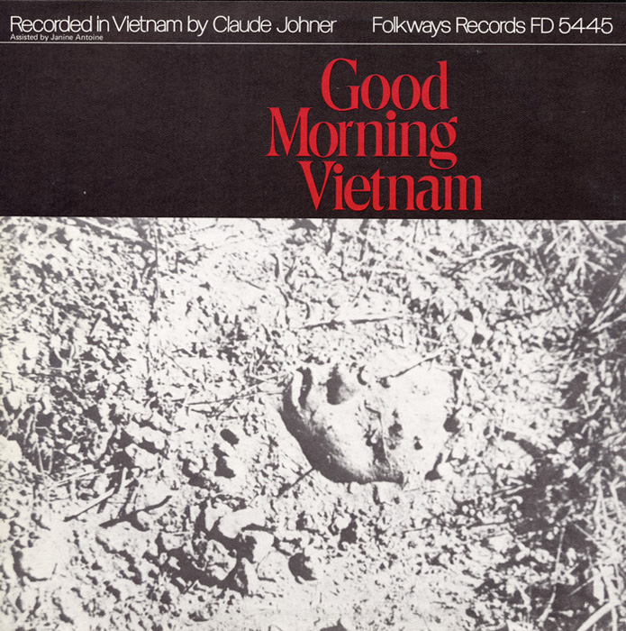
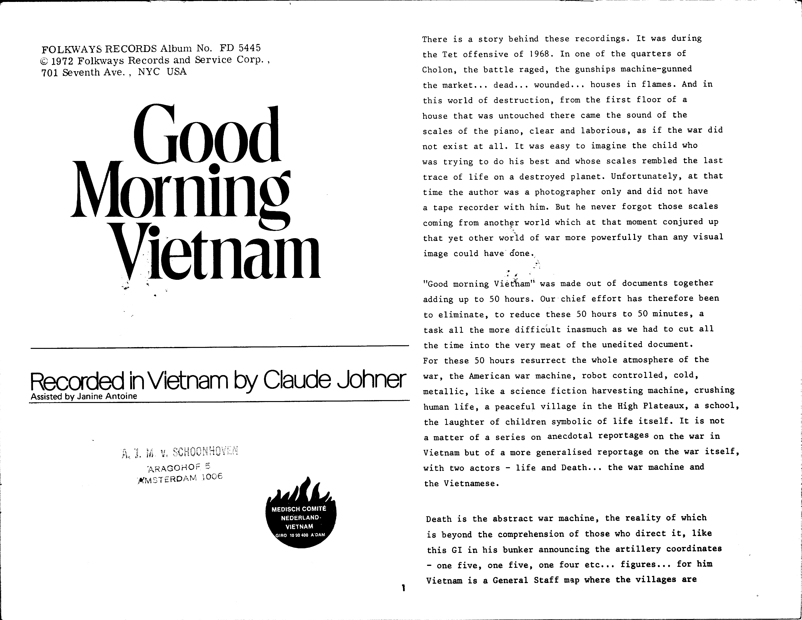
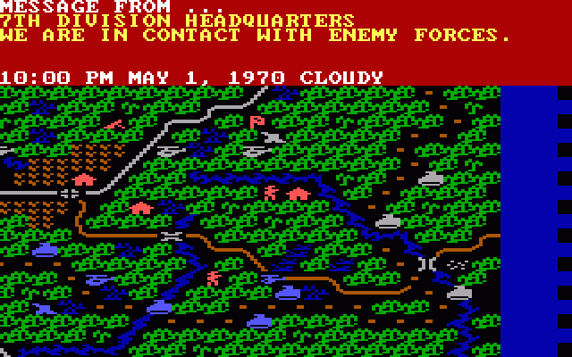
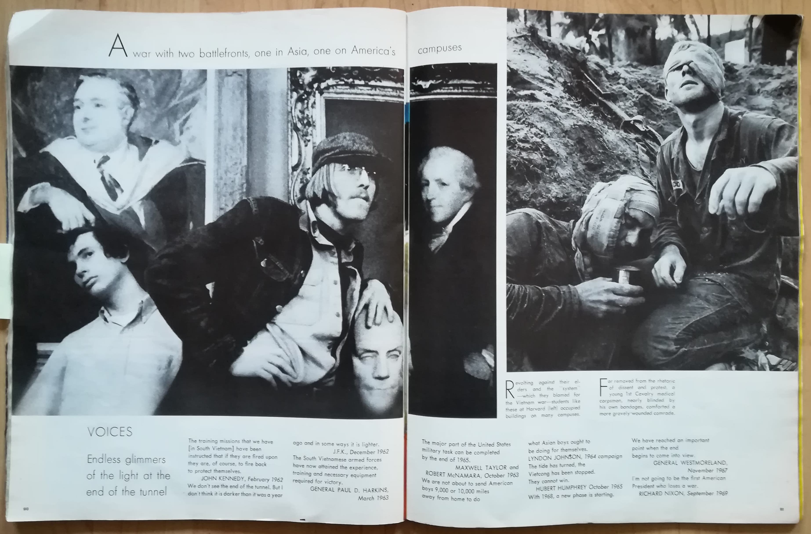
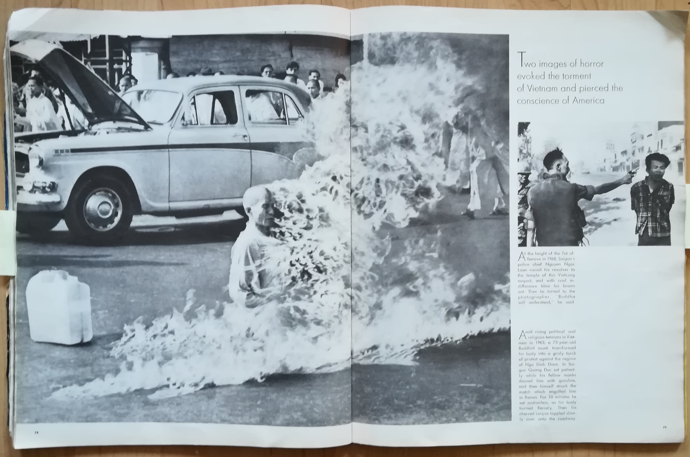
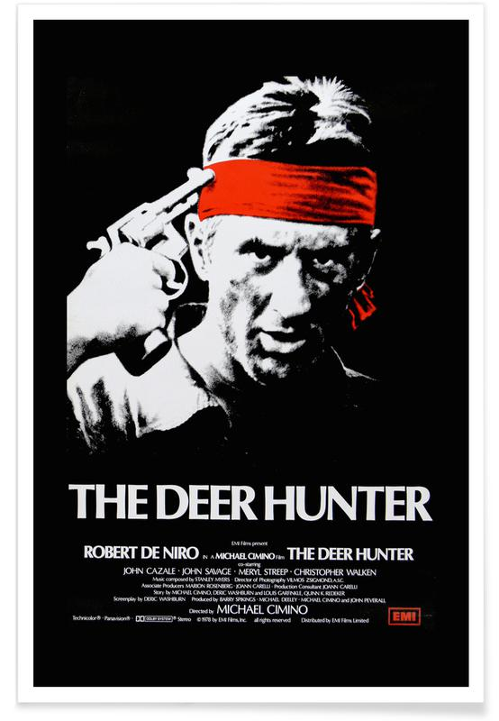

# Sound of war

## ARTIFACT 

### Goodmorning Vietnam + Script

Made by Claude Johner (Photographer) and assistant Janine Antoine from 1968 to 1972 in Vietnam : <em>the ravages of war</em>

## PROJECT GOAL

I want to use the Vietnam war as an example to show that the wars through time haven't change in form / outcome / reason. 
I'm portraying the uselessness of the wars through the function of the media during wartime. The media stands inbetween the civilians and the soldiers and is thereby the communication tool to keep both sides informed.

## TRANSCODING

### *Transcoding 1* : Script of the script

- **Description** : This script has explanatory information as extra layer next to the original script of the record

- **Tool** : Indesign

- **Outcome** : Printed matter
[Script of the script.pdf](https://s3-us-west-2.amazonaws.com/secure.notion-static.com/618a6812-87d7-4a31-b5e9-3b86057a215e/Script_of_the_script.pdf)

- **Lost in translation** : 

### *Transcoding 2* : Listening Excersise

- **Description** : I asked six different people with an diversity in background, studie and age to listen to the soundfiles of the record and try to visualise this.

- **Tool** : 

- **Outcome** : mp3 + jpg
[Listing excersise.pdf](https://s3-us-west-2.amazonaws.com/secure.notion-static.com/0c9958b7-a467-4f61-9290-36d117c6cc83/Listing_excersise.pdf)

- **Lost in translation** : The sounds are getting out of context, so the meaning changes of the sound files.

### *Transcoding 3* : Enviroment objects react on sound

- **Description** : I created in Cinema 4D water and trees that move on the sound of the record. I want to create a world were you can walk through. While experiencing the world around you, you are surrounded by the sounds of the Vietnam war. 

- **Tool** : Cinema 4D

- **Outcome** : mp4
https://www.youtube.com/watch?v=rSOiuT7APyk&feature=youtu.be

https://www.youtube.com/watch?v=JOOtaGp43PI&feature=youtu.be

- **Lost in translation** : 

### *Transcoding 4* : Counter-reaction on record 

- **Description** : With this experiment I want to visualize the prostest against the Vietnam war that was going on in the Vs. To show that there was a war on two battle fronts.

- **Tool** : Adobe Audition 

- **Outcome** : mp3
https://www.youtube.com/watch?v=gJxc09mGMtE

- **Lost in translation** : The narritive that the maker of the record created, I toke apart one of the sound files and made a new narritive togheter with the counter-reaction.

### *Transcoding 5* : Photo serie of Vietnam video footage

- **Description** : A structure of images from news reports made during the Vietnam war.

- **Tool** :  

- **Outcome** : 

- **Lost in translation** : 

[reporters.pdf](https://s3-us-west-2.amazonaws.com/secure.notion-static.com/0c9958b7-a467-4f61-9290-36d117c6cc83/reporters.pdf)

--*Still in proces*--

### *Transcoding ...* : Sound Library 

- **Description** : With this experiment I want to create a library that archives different sounds from war and the counter-reactions on war. 

https://docs.google.com/spreadsheets/d/1PEY84a24MVroX8h2NeJAVdCPRWwuLJ8HOqL3oDlx_xA/edit?usp=sharing

  
  
### *Transcoding ...* : Website as instrument

- **Description** : Compose with the sound files a contemporary visual of war.
  
  https://youtu.be/lrLUtJWRRbA

## FINAL OUTCOME

- **Description** : With the libary of sounds and the visual experiments I create an visual (Interactive) soundscape.

- **Tool** : MAX 8

- **Outcome** :

- **Lost in translation** :

## INSPIRATION

- **Video games** : bringing the war home 

- **Napalm girl** : Facebook censoring

  [Fury as Facebook bans 'Napalm girl' image](https://www.bbc.com/news/technology-37318031)
  
  [WPPH](https://janrosseel.com/archive%2Fwpph)
  
  <em>Has since been used on various occasions to illustrate the horrors of modern warfare. But for Facebook, 
  the image of the girl, Phan Thi Kim Phuc, was one that violated its standards about nudity on the social network.</em>

- **Apocalypse Now**

  

- **Lauren Alexander : migrate draw your house**

  [GROUNDPLAN DRAWINGS - Foundland Collective](http://foundland.info/GROUNDPLAN-DRAWINGS)

- **Wag the dog** 

  

  *Shortly before an election, a spin-doctor and a Hollywood producer join efforts to fabricate a war in order to cover up a Presidential sex scandal.*
  
- **"Playing Metal Gear Solid V: The Phantom Pain"**

  [Jamil Jan Kochai Reads "Playing Metal Gear Solid V: The Phantom Pain" - The New Yorker: The Writer's Voice - New Fiction from The New Yorker](https://pca.st/19vld8tq)
  
- **The Stench of World War I by Sissel Tolaas**

  

- **Childern play games, playing the war**

  [Francis Alÿs](https://www.eyefilm.nl/en/exhibition/francis-alÿs)

- **Conflict in Vietnam gameplay** (PC Game, 1986)

  
  
- **Life Magazine : The 60's** : 
  *A war with two battlefronts, one in Asia, one on America's campuses*
  
  

  
  
- **Bear 71**

  [NFB/Interactive - Bear 71](http://www.bear71.nfb.ca/#/bear71)
  
- **War Primer 2** Broomberg and shanarn : Archive of the conflict 

  *How to represent one aspect out of a historic event*
  
   [Archive of Modern Conflict - Photobooks and artist's books](https://archiveofmodernconflict.com)
  
  

  
  
- **[Stefan Schafer](http://stefanschafer.net) - Death and Digital**

- **The Deer Hunter** 
  *An in-depth examination of the ways in which the U.S. Vietnam War impacts and disrupts the lives of people in a small     industrial town in Pennsylvania.*
  
   

 
  

