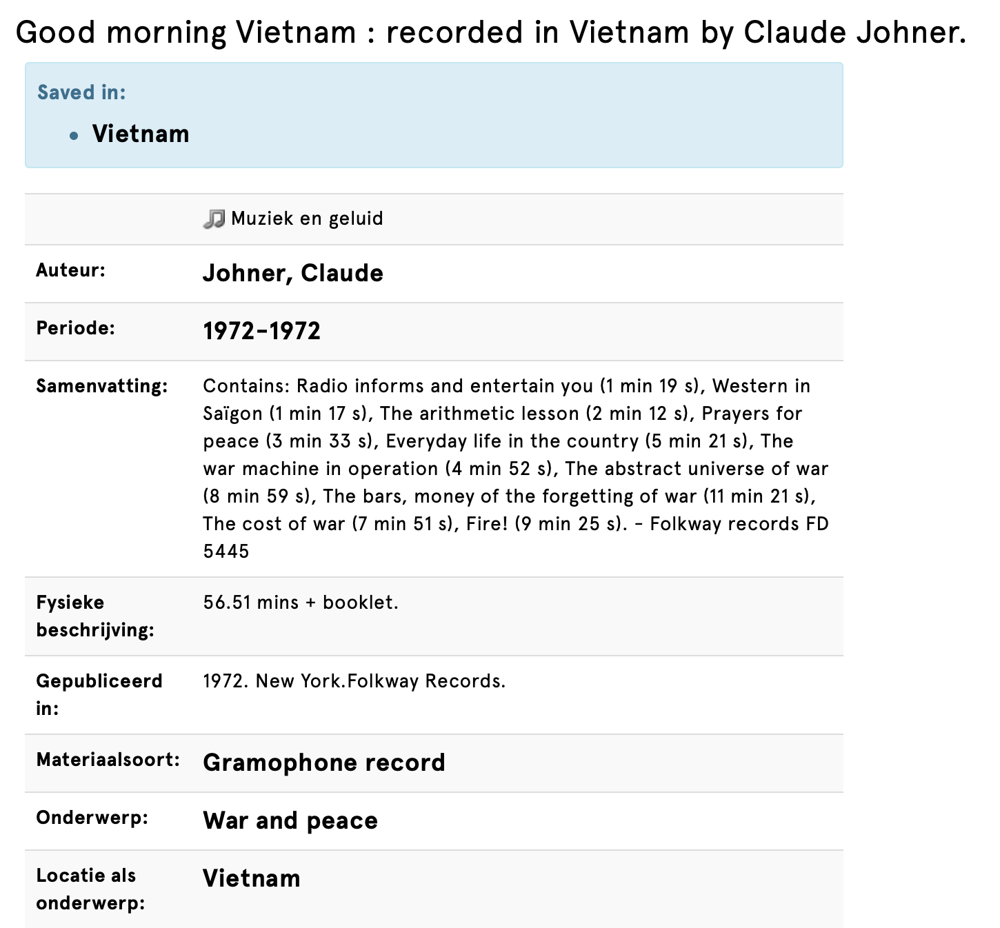
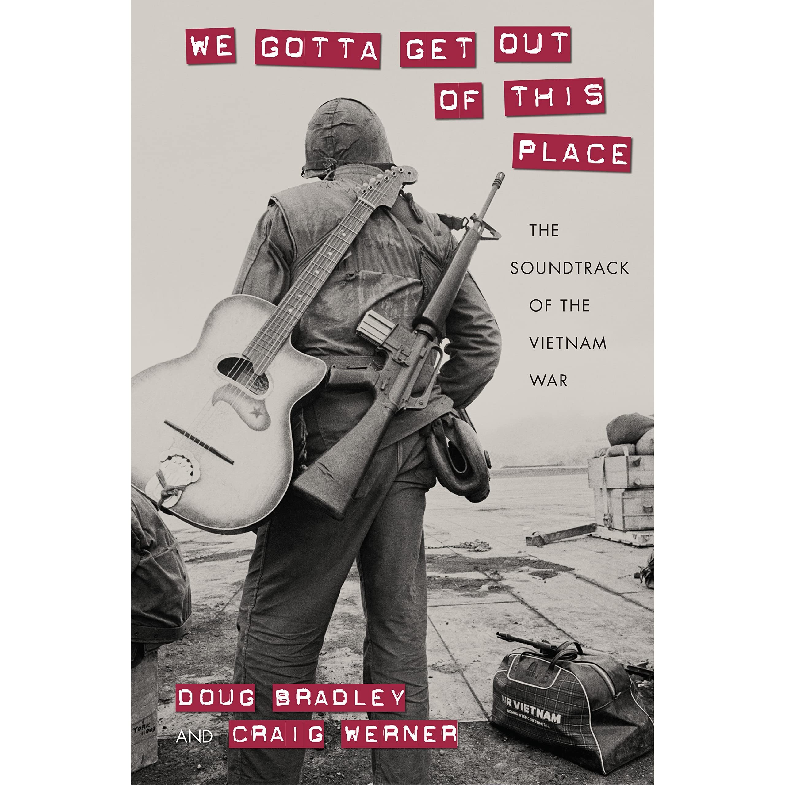

# IMD

https://www.notion.so/merellois/IMD-c2520b90f8174c89bf8627ac1744e33c

# Sound of war

### How to document a war

Claude Johner (Photographer) and assistant Janine Antoine made a textual resource in historical production from 1968 to 1972 in Vietnam : the ravages of war

[Good Morning, Vietnam : article ](https://folkways.si.edu/good-morning-vietnam/american-history-documentary-world-history/album/smithsonian)

**Feedback Hannes:**

: Urgency for this work

: Contemporary link

- Video gaming and war

# Inspiration

**Bringing the war home : Video games**

[Even Realistic Videogames like Call of Duty Won't Help Us Win Wars](https://www.wired.com/story/even-realistic-videogames-like-call-of-duty-wont-help-us-win-wars/)

- "Napalm girl" : Facebook censoring

[Fury as Facebook bans 'Napalm girl' image](https://www.bbc.com/news/technology-37318031)

[JAN ROSSEEL - WPPH](https://janrosseel.com/archive%2Fwpph)

Has since been used on various occasions to illustrate the horrors of modern warfare. But for Facebook, the image of the girl, Phan Thi Kim Phuc, was one that violated its standards about nudity on the social network.

*De omkering onderstreept de steeds lastiger wordende positie van Facebook als een
scheidsrechter van massamedia*

- Apocalypse Now

Kapitein Willard, een gelouterde officier die in het recente verleden in Vietnam geheime opdrachten voor de CIA heeft uitgevoerd, waaronder liquidaties, gaat in opdracht van de Amerikaanse legerleiding op zoek naar de gedeserteerde hoogbegaafde en hooggedecoreerde kolonel Kurtz, die met een inboorlingenlegertje een eigen oorlog voert.

Tijdens zijn tocht, door de jungle van Vietnam en Cambodja over de (fictieve) Nung-rivier, geraakt kapitein Willard echter meer en meer gefascineerd door zijn 'doelwit' en plaatst hij vraagtekens bij zijn opdracht en de hypocrisie van de Amerikaanse legerleiding: To charge a guy with murder in this place, was like handing out speeding tickets at the Indy 500. De tocht, middels een kleine patrouilleboot met een kleurrijke bemanning, vormt een afspiegeling van de Vietnamoorlog met onder andere een show met Playboy-bunny's en een verwoestende helikopteraanval door een luchtcavalerie-eenheid onder leiding van de excentrieke luitenant-kolonel Bill Kilgore.

- Lauren Alexander : migrate draw your house

    [GROUNDPLAN DRAWINGS - Foundland Collective](http://foundland.info/GROUNDPLAN-DRAWINGS)

- Wag the dog : movie comedy

Shortly before an election, a spin-doctor and a Hollywood producer join efforts to fabricate a war in order to cover up a Presidential sex scandal.

[Jamil Jan Kochai Reads "Playing Metal Gear Solid V: The Phantom Pain" - The New Yorker: The Writer's Voice - New Fiction from The New Yorker](https://pca.st/19vld8tq)

### *The Stench of World War I* by Sissel Tolaas

[World War One Trench Warfare](https://owlcation.com/humanities/World_War_1_Trench_Warfare)

**Roll of media in war**

censorship

self made material : Iraq wars

### What to do?

- record recording
    - [x]  Listing exercise with record : with visuals they think of
    - [ ]  Verwerken van Listing Excersise in script
- Metadata of the record

    

- Script
    - [x]  Transcode the script
- Video games research

    [The Video-Game Invasion of Iraq](https://www.newyorker.com/tech/annals-of-technology/the-video-game-invasion-of-iraq)

The roll of visuals

# Visual idea's

**Performance / installation**

- Cinema 4d = shapes moves on the rythm of the sound

    Creating a visual soundscape = IMD opdracht year 2 semester 2

- Interactive soundscape
- Making mix's of the founded sounds : Synthesizer

**Tools**

Unitity 

Cinema4D

Virtual Reality = video game

*Studio Moross*

# Script Information

[https://www.youtube.com/watch?time_continue=277&v=HwpzzAefx9M&feature=emb_logo](https://www.youtube.com/watch?time_continue=277&v=HwpzzAefx9M&feature=emb_logo)

I**nternational humanitarian law :** The Geneva Conventions of 1949

[The 'Rules Of War' Are Being Broken. What Exactly Are They?](https://www.npr.org/sections/goatsandsoda/2018/06/28/621112394/the-rules-of-war-are-being-broken-what-exactly-are-they?t=1583664742148)

*For a Kentucky rifleman who spent his tour trudging through Vietnam’s Central Highlands, it was Nancy Sinatra’s “These Boots Are Made for Walkin’.” For a “tunnel rat” who blew smoke into the Viet Cong’s underground tunnels, it was Jimi Hendrix’s “Purple Haze.” For a black marine distraught over the assassination of Martin Luther King Jr., it was Aretha Franklin’s “Chain of Fools.” And for countless other Vietnam vets, it was ”I Feel Like I’m Fixin’ to Die,” “Who’ll Stop the Rain,” or the song that gives this book its title.*

[President Johnson announced his decision to halt the bombing of North Vietnam. - LBJ Presidential Library](http://www.lbjlibrary.org/exhibits/the-president-announcing-his-decision-to-halt-the-bombing-of-north-vietnam)

Record 4 : 1968 speech... "Peace in the world"

# Visualization of research

- **Script**

[Script of the script.pdf](https://s3-us-west-2.amazonaws.com/secure.notion-static.com/618a6812-87d7-4a31-b5e9-3b86057a215e/Script_of_the_script.pdf)

- **Listening excersice**

[Listing excersise.pdf](https://s3-us-west-2.amazonaws.com/secure.notion-static.com/0c9958b7-a467-4f61-9290-36d117c6cc83/Listing_excersise.pdf)

Track 2 - 6 - 7 - 9

Soyun : South Korea

Rob : The Netherlands / 70 years

Track 1 - 3 - 8

Agata : Poland

Sahista : Suriname / non-Kabk

Track 4 - 5 - 10 

Ruben : The Netherlands / Gamer / non-kabk

Cami : Argentina

### Feedback 9/3 Hannes

*Instruction / documentation of the outcome of this assigment :*

*people know how to apply your tool.*

- Eye museum : Childern play games, playing the war

- How to present the different layers of the **listening excerxise**

    The different information layers

    Image of the script and the listening excersise image

- Transcode the **script**

    Digitial format / screenbased 

    With what tool do I translate the script

    ***layering of depth***

    why do i do this = searchable / more visual

    How it change over time

    [What does war sound like now?](https://www.bbc.com/news/magazine-20400030)

- Vietnam war relates in video games

    How it looks like in games

    *Interview with Ruben*

    **Indie gaming** = function of games

    

- How people reacte while  playing video games

    *Twitch : live streaming how gamers game*

    [Twitch](https://www.twitch.tv)

**Giving shape to the research : what i want to visualise**

**Research questions : What is my goal with the outcome of this project**

- How can you make people understand a situation if they were never there?
- How can you let people experience an phenomenon thorugh technology that they never faced in real life?
- How do people expierence a war? When everybody has an other conecction to it.

1. Script = main source
    - reaction of the script
    - War change over time
    - listening excersise

**[Markdown](https://www.markdownguide.org/basic-syntax) :**

**How do i do the documentation : info architecture / clear structure**

What i do where = in cinema 4d, laat ik dit en dit zien...

**Feedback 16-03 Martijn**

specifieker op de geluiden van de lp

media van de oorlog = protest 

lp neil jong

beeldvorming van toen overgedragen naar nu

hoe word een oorlog herrinderd

Unity: elementen waarmee ik het landschap ga bouwen - excersise

**Narritive**

[NFB/Interactive - Bear 71](http://www.bear71.nfb.ca/#/bear71)

Het probleem dat door mensen beren dood gaan - visualiseren door het gebied weer te geven en jou de mens laat te zijn maar de stem van de beer te horen

- interactive game + luitsteren = ondersteund elkaar om het verhaal duidelijk over te brengen
